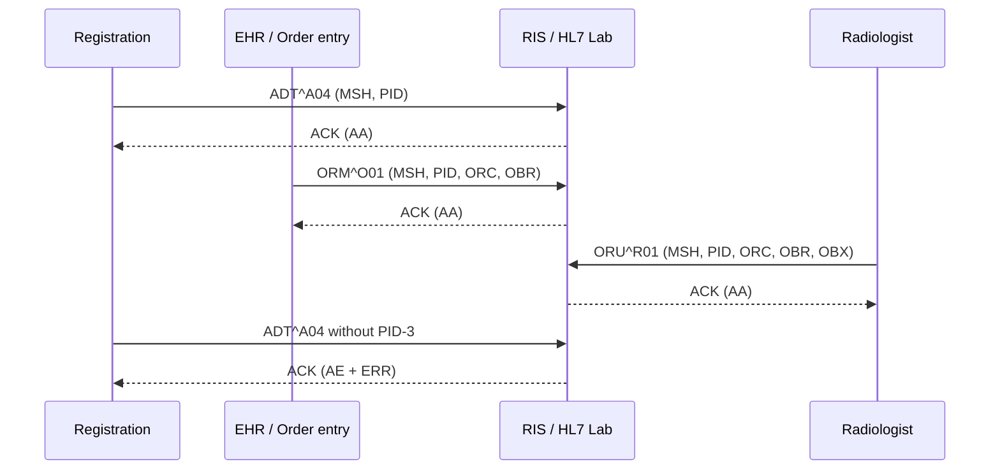

# Radiology workflow

```mermaid
sequenceDiagram
    participant REG as Registration
    participant EHR as EHR / Order entry
    participant RIS as RIS / HL7 Lab
    participant RAD as Radiologist
    REG->>RIS: ADT^A04 (MSH, PID)
    RIS-->>REG: ACK (AA)
    EHR->>RIS: ORM^O01 (MSH, PID, ORC, OBR)
    RIS-->>EHR: ACK (AA)
    RAD->>RIS: ORU^R01 (MSH, PID, ORC, OBR, OBX)
    RIS-->>RAD: ACK (AA)
    REG->>RIS: ADT^A04 without PID-3
    RIS-->>REG: ACK (AE + ERR)
```
